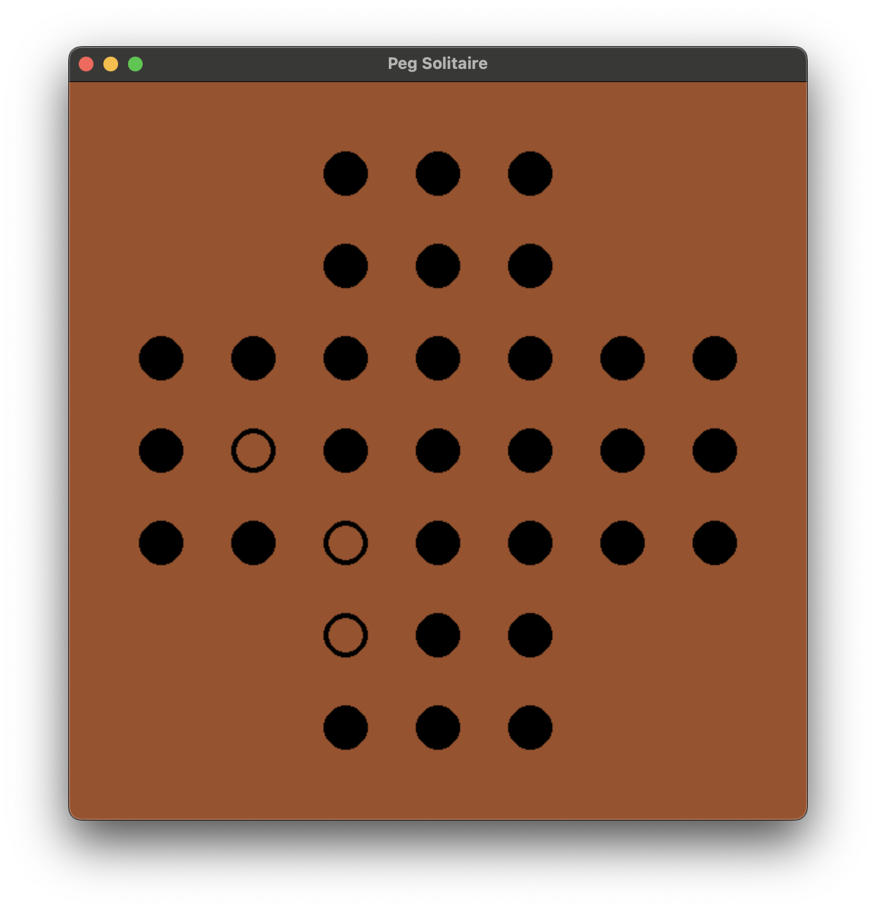

# Peg-Solitaire

A [Peg Solitaire](https://en.wikipedia.org/wiki/Peg_solitaire) game written in Python.

## Dependencies
- [PyGame](https://pyga.me/docs/index.html)

## Installation
```
pip install pygame-ce
```

## Running
```
python src/main.py
```


